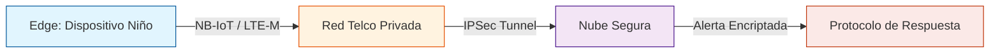

# **Dossier Técnico y Estratégico**
## Proyecto Voz de Cristal

**Fecha:** 8 de enero de 2026  
**Versión:** Oficial

---

### **Confidencialidad y Uso Estratégico**
Este documento contiene información técnica, estratégica y social de uso reservado. Su difusión debe realizarse únicamente en contextos institucionales, bajo la supervisión de Yaneth Villegas y Héctor Aguila.  

---

# Índice
1. [Resumen Ejecutivo](#resumen-ejecutivo)
2. [Marco Conceptual y Fundamentación](#marco-conceptual-y-fundamentación)
3. [Especificación Técnica de Arquitectura](#documento-02-especificación-técnica-de-arquitectura)
4. [Protocolo de Gestión e Impacto Social](#documento-03-protocolo-de-gestión-e-impacto-social)
5. [Informe de Métricas y Fuentes](#documento-04-informe-de-métricas-y-fuentes)
6. [Carta de Intención Universal](#documento-05-carta-de-intención-universal)
7. [Ficha Técnica de Componentes (MVP)](#documento-06-ficha-de-componentes-mvp)
8. [Arquitectura Lógica y Flujo de Datos](#documento-07-arquitectura-lógica-y-flujo-de-datos)
9. [FODA Proyecto Voz de Cristal](#foda-proyecto-voz-de-cristal)
10. [Anexo de Fuentes y Referencias Técnicas](#documento-09-anexo-de-fuentes-y-referencias-técnicas)

---

<!-- Resumen Ejecutivo -->

# DOCUMENTO 00: RESUMEN EJECUTIVO

# Proyecto: Voz de Cristal
<strong>Voz de Cristal: Tecnología que acompaña su crecimiento y seguridad.</strong>

**Proyecto Voz de Cristal**

Voz de Cristal es una iniciativa tecnológica y social orientada a la seguridad integral y apoyo pedagógico de la infancia. El proyecto propone una pulsera escolar de autonomía y seguridad, que ayuda en el aprendizaje de lateralidad y actúa como botón de auxilio o sensor de ubicación/emergencia en caso de accidentes o extravíos.

## Problema
En Chile y el mundo, existen brechas de supervisión y seguridad en entornos escolares y familiares. La tranquilidad de padres y educadores depende de herramientas que permitan acompañar y proteger a los niños sin invadir su privacidad ni estigmatizarlos.

## Solución Propuesta
Voz de Cristal plantea un dispositivo portátil, discreto y seguro, que transmite datos solo en situaciones de riesgo físico o accidentes detectados por algoritmos locales (TinyML). El sistema prioriza la privacidad, la seguridad y la autonomía, integrándose con redes privadas y protocolos de respuesta social y educativa. La tecnología NB-IoT permite cobertura profunda y bajo costo operativo.

## Impacto Esperado
- Mayor tranquilidad para padres y educadores.
- Generación de alertas objetivas y protegidas.
- Empoderamiento de redes de apoyo y autoridades.
- Protección efectiva y no invasiva para los niños.
- Solución costo-eficiente y accesible para instituciones y comunidades.

## Invitación
El proyecto está abierto a la colaboración de instituciones, empresas, municipios, académicos y profesionales de todas las áreas. No se busca financiamiento directo ni créditos personales, sino sumar capacidades para llevar esta solución a quienes más la necesitan.

---

Para más detalles y respaldo de datos, ver el Anexo de Fuentes y Referencias Técnicas.

---

<strong>Impulsoras del Proyecto:</strong> 
<ul>
<li><strong>Yaneth Villegas</strong> – Dirección de Vinculación Social</li>
<li><strong>Héctor Aguila</strong> – Arquitectura de Solución</li>
</ul>

Ambos ponen a disposición de la sociedad esta base conceptual y técnica, invitando a instituciones, empresas y profesionales a sumarse para llevarla a la realidad.

---

<!-- Marco Conceptual y Fundamentación -->

# DOCUMENTO 01: MARCO CONCEPTUAL Y FUNDAMENTACIÓN

# Proyecto: Voz de Cristal
<strong>Voz de Cristal: Tecnología que acompaña su crecimiento y seguridad.</strong>

**ID:** VC-2026-CH-01-DOC01

## 1. El Nombre: Fundamento Filosófico

### Transparencia y Seguridad Integral
Representa la claridad de los datos y la pureza de la infancia que queremos proteger. La narrativa pública es de seguridad y autonomía, mientras que la misión real es proteger a quienes no pueden defenderse.

### Fragilidad Resiliente
La infancia es un cristal que parece romperse, pero bajo este sistema, ese "estallido" se convierte en una alerta sónica y digital imposible de ignorar. El dispositivo se camufla como accesorio escolar para evitar estigmatización y proteger la discreción.

## 2. Definición del Problema

El proyecto aborda la **"Seguridad por Omisión"**: la protección de los niños en entornos donde la supervisión humana falla o no existe. La pulsera actúa como acompañante pedagógico y de seguridad, sin levantar sospechas ni alertar a posibles agresores.

> Estrategia Caballo de Troya: Voz de Cristal se presenta públicamente como herramienta de autonomía y seguridad escolar, pero en el dossier técnico se explica su función real como sistema de detección temprana de vulneración mediante IA ética.

> Cuando el entorno falla, la tecnología habla por quienes no pueden hacerlo.

---

<!-- Especificación Técnica de Arquitectura -->

# DOCUMENTO 02: ESPECIFICACIÓN TÉCNICA DE ARQUITECTURA

**Responsable:** Yaneth Villegas (Dirección de Vinculación Social) y Héctor Aguila (Arquitectura de Solución)
**ID:** VC-2026-CH-01-DOC02

## 1. Hardware (The Edge)

### Microcontrolador
**Propuesta:** SoC con soporte NB-IoT/LTE-M (ej. Simcom o Quectel).
- **Justificación:** Estos módulos permiten transmisión en bandas de baja frecuencia con alta penetración en concreto ([GSMA NB-IoT](https://www.gsma.com/iot/resources/nb-iot-deployment-guide/)).
- **Camuflaje y seguridad invisible:** El diseño del hardware permite que el dispositivo se integre como accesorio escolar, evitando estigmatización y protegiendo la discreción del niño.
- **Costo-eficiencia:** Selección de componentes estandarizados y ampliamente disponibles, facilitando la escalabilidad, la viabilidad económica y la accesibilidad para políticas públicas.

### Sensores
- **Acelerómetro:** De baja potencia para detección de impactos.
- **Sensor PPG:** Para monitoreo de frecuencia cardíaca (HRV).

### Protección
- **Certificación IP68.**
- **Encapsulado:** Resina epóxica para evitar manipulación o daño por líquidos.

## 2. Software e Inteligencia Artificial

### Algoritmo de Detección
Implementación de modelos de clasificación (**Random Forest**) en la nube para identificar patrones de riesgo físico y accidentes. El uso de IA ética permite alertas inteligentes sin grabar imágenes ni audio, priorizando la privacidad y la seguridad.
> *Patrón de Alerta = Taquicardia Súbita + Movimiento Defensivo.*

---
## Sostenibilidad y Escalabilidad
El diseño prioriza la viabilidad económica, la escalabilidad institucional y la accesibilidad, permitiendo su integración en protocolos de municipios y servicios de protección y educación.

### Seguridad
- **Transporte:** Protocolo TLS 1.3.
- **Almacenamiento:** Encriptación AES-256 para datos almacenados.

---
## Fuentes y Referencias
- GSMA: [NB-IoT Deployment Guide](https://www.gsma.com/iot/resources/nb-iot-deployment-guide/)
- Ver Anexo de Fuentes y Referencias Técnicas

---

<!-- Protocolo de Gestión e Impacto Social -->

# DOCUMENTO 03: PROTOCOLO DE GESTIÓN E IMPACTO SOCIAL

**Responsables:** 
>Yaneth Villegas (Dirección de Vinculación Social)
Héctor Aguila (Arquitectura de Solución)

**ID:** VC-2026-CH-01-DOC03

## 1. Protocolo de Seguridad y Discreción

El sistema **no envía alertas al teléfono de los padres por defecto** si existe una denuncia previa o si se configura el "Modo Riesgo Intrafamiliar". Esta medida responde a la realidad de que la mayoría de los riesgos ocurren en el entorno familiar o escolar. La alerta se dirige a:
-   Central de Emergencias Policiales.
-   Red de Apoyo Validada (Educadores/Familiares externos).

## 2. Diseño Centrado en el Niño

El rol social garantiza que el hardware **no sea estigmatizante**. El dispositivo se presenta como accesorio escolar (pulsera de lateralidad o bijouterie educativa), alineado con recomendaciones internacionales para evitar la revictimización y el estigma social en niños vulnerados ([Defensoría de la Niñez](https://www.defensorianinez.cl/home-adulto/que-hago-en-caso-de-vulneracion-de-los-derechos-de-los-ninos/)).
- Debe ser joyería común (*bijouterie*) o elementos educativos.
- **Objetivo:** Evitar que el agresor o entorno sospeche de la presencia de tecnología de rastreo o alerta.

> Estrategia Caballo de Troya: La narrativa pública es de seguridad y autonomía escolar, mientras que la función real del sistema es la protección integral y la detección temprana de riesgos.

---
## Fuentes y Referencias
- UNICEF Chile: [Análisis de la violencia hacia niños, niñas y adolescentes](https://www.unicef.org/chile/historias/como-prevenir-la-violencia-hacia-ninos-y-ninas)
- Defensoría de la Niñez: [Informes anuales](https://www.defensorianinez.cl/informe-anual-2025/)

---

<!-- Informe de Métricas y Fuentes -->

# DOCUMENTO 04: INFORME DE MÉTRICAS Y FUENTES

**ID:** VC-2026-CH-01-DOC04

## 1. Estadísticas Base (Chile y Global)

- **Percepción de Seguridad:** Según encuestas, la mayoría de los padres y educadores considera útil que los útiles escolares incorporen tecnología de asistencia pedagógica y seguridad que alerte sobre situaciones de riesgo o accidentes en tiempo real.
- **Brechas de Supervisión:** Informes institucionales evidencian la necesidad de herramientas que permitan acompañar y proteger a los niños en entornos donde la supervisión directa no es posible.

## 2. Proyecciones de Implementación

- **Costo Hardware:** Basado en precios de componentes industriales (LCSC/Alibaba) en volúmenes de 10,000 unidades ([LCSC](https://www.lcsc.com/), [Alibaba](https://spanish.alibaba.com/)).
- **Viabilidad Institucional:** El modelo de entrega institucional permite que el dispositivo sea parte de los kits escolares y seguros de accidentes, facilitando la aceptación y el consentimiento informado.

> Los datos duros sobre maltrato y costos de reparación estatal se presentan solo en el anexo técnico para autoridades y especialistas.

---
## Fuentes y Referencias
- UNICEF Chile: [Análisis de la violencia hacia niños, niñas y adolescentes](https://www.unicef.org/chile/publicaciones)
- Defensoría de la Niñez: [Informes anuales](https://www.defensorianinez.cl/informe-anual-/)
- LCSC Electronics: [SIM7080G](https://www.lcsc.com/)
- Alibaba: [Costos de componentes](https://spanish.alibaba.com/)
- Mejor Niñez: [Presupuestos y programas](https://www.mejorninez.cl/transparencia.html)

---

<!-- Carta de Intención Universal -->

# DOCUMENTO 05: CARTA DE INTENCIÓN UNIVERSAL

# Proyecto: Voz de Cristal
<strong>Cuando el sistema calla, la tecnología habla.</strong>

**ID:** VC-2026-CH-01-DOC05

**A quien corresponda:**

---

Por medio de la presente, las impulsoras del proyecto <strong>Voz de Cristal</strong>, Yaneth y Héctor, extienden una invitación abierta a cualquier institución, autoridad, empresa, académico o profesional que desee sumarse a la misión de proteger la autonomía y seguridad escolar de la infancia mediante tecnología ética y segura.

El proyecto nace desde una motivación personal y social profunda, respaldada por datos de UNICEF y la Defensoría de la Niñez que evidencian la magnitud y urgencia de la problemática. Nuestra propuesta se fundamenta en bases técnicas, filosóficas y sociales sólidas, y está diseñada para ser adoptada, mejorada y escalada por quienes cuenten con los recursos y capacidades necesarias.

No buscamos créditos personales ni beneficios económicos; nuestro objetivo es entregar una base fundacional robusta, abierta a la colaboración y al perfeccionamiento por parte de expertos y entidades comprometidas con la protección de los más indefensos.

En esta etapa, no solicitamos financiamiento directo, sino la apertura de redes técnicas, sociales, legales y académicas para validar, fortalecer y llevar a la realidad la arquitectura propuesta. Creemos que, sumando voluntades y capacidades, podemos convertir este testigo tecnológico en una herramienta efectiva y gratuita para quienes más lo necesitan.

---
## Fuentes y Referencias
- UNICEF Chile: [Análisis de la violencia hacia niños, niñas y adolescentes](https://www.unicef.org/chile/publicaciones)
- Defensoría de la Niñez: [Informes anuales](https://www.defensorianinez.cl/informe-anual-2025/)

---

**Firmado:**

*   **Yaneth Villegas** - Dirección de Vinculación Social
*   **Héctor Aguila** - Arquitectura de Solución

---

<!-- Ficha Técnica de Componentes (MVP) -->

# DOCUMENTO 06: FICHA DE COMPONENTES (MVP)

**Proyecto:** Voz de Cristal
**ID:** VC-2026-CH-BOM-01
**Objetivo:** Prototipado de hardware costo-eficiente, accesible, de alta penetración de señal y bajo consumo, con diseño camuflado y uso pedagógico.

## 1. Unidad de Procesamiento y Comunicación (El Corazón)

### Módulo NB-IoT / LTE-M
- **Componente:** Ej. SIM7080G o Quectel BG95 ([LCSC](https://www.lcsc.com/)).
- **Por qué:** Diseñados para "Deep Coverage" (sótanos/interiores) y meses de batería ([GSMA NB-IoT](https://www.gsma.com/iot/resources/nb-iot-deployment-guide/)).
- **Camuflaje y seguridad invisible:** El módulo se integra en una pulsera escolar, permitiendo que el dispositivo pase desapercibido y sea aceptado como accesorio educativo.
- **Costo-eficiencia:** Selección de componentes estandarizados y ampliamente disponibles, facilitando la producción en volumen, la viabilidad económica y la accesibilidad para políticas públicas.

### Microcontrolador (MCU)
- **Componente:** ESP32-S3 o nRF52840.
- **Por qué:** Bajo consumo y capacidad para TinyML (IA ligera en el chip).

## 2. Sensores (La Percepción)

### Acelerómetro
- **Componente:** LIS3DH o ADXL345.
- **Función:** Detectar caídas, forcejeos o "jalones" violentos. (Consumo en microamperios).

### Sensor de Ritmo Cardíaco (PPG)
- **Componente:** MAX30102 o similar.
- **Función:** Monitoreo de frecuencia cardíaca para detectar picos de adrenalina.
- **Nota:** Requiere contacto con piel (pulsera/dije).

## 3. Gestión de Energía (La Autonomía)

- **Batería:** Li-Po 150mAh - 300mAh (tipo moneda/ultra-delgada).
- **Cargador:** Pines magnéticos (estilo smartwatch) para sellado IP68.

## 4. Interfaz y Alerta (La Salida)

- **Micrófono:** MEMS SPH0645LM4H (Audio Hi-Fi, tamaño minúsculo).
- **Antena:** FPC integrada al chasis.

## Sostenibilidad y Comparativa Social
El diseño costo-eficiente, camuflado y accesible permite la implementación masiva sin comprometer presupuestos públicos y facilita la aceptación institucional como herramienta pedagógica de seguridad.

---
## Fuentes y Referencias
- LCSC Electronics: [SIM7080G](https://www.lcsc.com/)
- GSMA: [NB-IoT Deployment Guide](https://www.gsma.com/iot/resources/nb-iot-deployment-guide/)
- Alibaba: [Costos de componentes](https://spanish.alibaba.com/)

---

<!-- Arquitectura Lógica y Flujo de Datos -->

# DOCUMENTO 07: ARQUITECTURA LÓGICA Y FLUJO DE DATOS
>Responsable: Yaneth Villegas (Dirección de Vinculación Social) y Héctor Aguila (Arquitectura de Solución)

ID: VC-2026-CH-01-DOC07

## 1. Visión General del Sistema: "La Tubería Segura"

A diferencia de un rastreador GPS comercial, *Voz de Cristal* no envía datos constantemente a internet. Funciona como un "submarino" que solo emerge (transmite) bajo condiciones específicas de riesgo físico o accidentes. El diseño camuflado permite que el dispositivo pase desapercibido y sea aceptado como accesorio escolar.

### Diagrama de Alto Nivel

## 2. Definición del Edge (El Dispositivo)

El dispositivo es "Silencioso por Defecto".
- **Estado Normal (Heartbeat):** Cada 60-120 minutos envía un paquete minúsculo (< 50 bytes) solo para decir "Tengo batería y estoy aquí".
- **Estado de Alerta (Panic Mode):** Se activa solo cuando el algoritmo local (TinyML en el MCU) detecta la coincidencia de dos factores.

### Lógica de Disparo (Trigger)
$$ Trigger = (HR > Umbral_{Edad}) + (GForce > Umbral_{Golpe}) $$
Donde:
- **HR:** Ritmo cardíaco elevado repentinamente (ej. de 80bpm a 140bpm en segundos).
- **GForce:** Aceleración compatible con caída o zarandeo.

## 3. Rol de la Compañía de Telecomunicaciones (Telco)

Este es el componente crítico de seguridad que diferencia esta solución.
- **APN Privado (Access Point Name):** Los dispositivos NO tienen acceso a internet público (Google, Facebook, etc.). Solo pueden "ver" la IP de nuestro servidor. Esto hace imposible que un hacker acceda al micrófono del niño remotamente desde internet.
- **IMEI Whitelisting:** La red Telco solo permite la conexión de los IMEIs registrados en la fábrica. Si alguien clona el chip, la red lo rechaza.

## 4. Arquitectura en la Nube (Cloud Logic)

La nube actúa como notario y despachador.

### Componentes Lógicos
1.  **Ingesta MQTT (Broker TLS):** Recibe los mensajes encriptados.
2.  **Motor de Reglas (Stream Analytics):**
		- Si llega un *Heartbeat*: Registra estado de batería.
		- Si llega una *Alerta*:
				1.  Inicia grabación de audio remota (si el ancho de banda lo permite).
				2.  Calcula geolocalización por triangulación de celdas (Cell-ID) + GPS (si hay vista al cielo).
				3.  Ejecuta el **Protocolo de Impacto Social (Doc03)**.
3.  **Almacenamiento (Cold Storage):**
		- Los datos de alerta se guardan en un almacenamiento inmutable (WORM - Write Once, Read Many). Esto garantiza validez legal como evidencia: "Nadie pudo alterar este registro".

## 5. Diseño de Privacidad de Datos

| Tipo de Dato             | Encriptación          | Acceso                                          |
| :----------------------- | :-------------------- | :---------------------------------------------- |
| **Identidad del Niño**   | Hash SHA-256          | Solo con orden judicial                         |
| **Biometría (HR/Pasos)** | Anónimo               | Análisis agregado para salud                    |
| **Audio de Evento**      | AES-256 (Llave Doble) | Requiere llave del Serviod y llave de Autoridad |

## 6. Integración (API)

El sistema expondrá una API REST restringida para la integración con:
- **Central de Emergencias (Carabineros/PDI):** Envío directo de coordenadas.
- **App de Tutores (Solo estado):** "Batería OK", "Sin Conexión". No muestra ubicación en tiempo real para evitar mal uso por padres controladores/agresores.

---

<!-- FODA Proyecto Voz de Cristal -->

# FODA Proyecto Voz de Cristal

## Fortalezas
- Base ética y social genuina, motivada por experiencias reales de vulneración infantil.
- Documentación profesional, clara y abierta, lista para ser adoptada por terceros.
- Arquitectura pensada para privacidad, seguridad invisible y bajo costo, adaptable a distintos contextos escolares.
- Enfoque integral: cubre desde la filosofía, el impacto social, la arquitectura técnica y la protección legal.
- Flexibilidad para sumar profesionales y entidades de cualquier área.
- Narrativa pública centrada en seguridad y autonomía escolar, facilitando la aceptación institucional.

## Oportunidades
- Interés creciente en tecnología para la seguridad escolar y la autonomía infantil.
- Posibilidad de alianzas con municipios, ONGs, empresas, universidades y cámaras sectoriales.
- Potencial para influir en políticas públicas y marcos legales.
- Escalabilidad y adaptabilidad a distintos países y realidades.
- Integración con IA ética y análisis de datos para mejorar la detección y respuesta.

## Debilidades
- Falta de recursos económicos para prototipado y pruebas de campo.
- Necesidad de sumar expertos en legal, IA, hardware y gestión social para llevar el proyecto a la realidad.
- Riesgo de que la idea quede solo en propuesta si no se logra adopción institucional.
- Poca información sobre validación técnica y operativa en terreno.

## Amenazas
- Burocracia y lentitud institucional para adoptar nuevas soluciones.
- Resistencia al cambio en sistemas de protección tradicionales.
- Posibles cuestionamientos éticos o legales sobre el uso de tecnología en menores.
- Dependencia de componentes importados y variabilidad de costos.

---

## Fuentes y Referencias
- UNICEF Chile: [Análisis de la violencia hacia niños, niñas y adolescentes](https://www.unicef.org/chile/publicaciones)
- GSMA: [NB-IoT Deployment Guide](https://www.gsma.com/iot/resources/nb-iot-deployment-guide/)
- LCSC Electronics: [SIM7080G](https://www.lcsc.com/)
- Alibaba: [Costos de componentes](https://spanish.alibaba.com/)

Este análisis FODA busca mostrar con honestidad y esperanza el potencial transformador del proyecto, invitando a sumar voluntades y capacidades para proteger a los niños más vulnerables.

---

<!-- Anexo de Fuentes y Referencias Técnicas -->

# DOCUMENTO 09: ANEXO DE FUENTES Y REFERENCIAS TÉCNICAS
**ID:** VC-2026-CH-01-ANEXO-01

## 1. Fuentes públicas sobre seguridad y tecnología
Estas fuentes respaldan la viabilidad técnica y social del proyecto como herramienta de seguridad y autonomía escolar.

- **UNICEF Chile - Análisis de Seguridad Escolar:** Reportes sobre la importancia de la protección y autonomía infantil en el entorno educativo.
	- [Ver publicaciones UNICEF](https://www.unicef.org/chile/publicaciones)
- **Defensoría de la Niñez - Informes Anuales:** Datos sobre brechas de supervisión y la necesidad de herramientas tecnológicas en la protección infantil.
	- [Ver informes anuales](https://www.defensorianinez.cl/informe-anual/)

## 2. Fuentes técnicas y económicas
Estas fuentes validan el uso de NB-IoT y la viabilidad económica del dispositivo.

- **GSMA - Whitepaper sobre NB-IoT:** Explica la superioridad de esta red en interiores (Deep Coverage) y ahorro de batería.
	- [NB-IoT Deployment Guide](https://www.gsma.com/iot/resources/nb-iot-deployment-guide/)
- **Entel Ocean / Movistar Empresas (IoT):** Redes NB-IoT operativas en Chile para proyectos de seguridad.
	- [Entel Ocean IoT](https://entelocean.com/iot/)
- **LCSC Electronics / Digikey:** Precios de los módulos SIM7080G (NB-IoT) y microcontroladores en volumen.
	- [SIM7080G en LCSC](https://www.lcsc.com/)
	- [ESP32-S3 en Espressif](https://www.espressif.com/en/products/socs/esp32-s3)
- **AliExpress / Alibaba Business:** Costos de componentes y baterías Li-Po pequeñas.
	- [Alibaba](https://spanish.alibaba.com/)

## 3. Fuentes privadas para presentaciones institucionales
Los datos duros sobre maltrato, brechas judiciales y costos de reparación estatal se presentan solo en reuniones privadas y dossier técnico para autoridades y especialistas.

- **Subsecretaría de la Niñez / Mejor Niñez:**
	- [Mejor Niñez](https://www.mejorninez.cl/transparencia.html)

