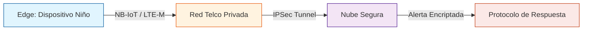

# DOCUMENTO 07: ARQUITECTURA LÓGICA Y FLUJO DE DATOS
>Responsable: Yaneth Villegas (Dirección de Vinculación Social) y Héctor Aguila (Arquitectura de Solución)

ID: VC-2026-CH-01-DOC07

## 1. Visión General del Sistema: "La Tubería Segura"

A diferencia de un rastreador GPS comercial, *Voz de Cristal* no envía datos constantemente a internet. Funciona como un "submarino" que solo emerge (transmite) bajo condiciones específicas de riesgo físico o accidentes. El diseño camuflado permite que el dispositivo pase desapercibido y sea aceptado como accesorio escolar.

### Diagrama de Alto Nivel

## 2. Definición del Edge (El Dispositivo)

El dispositivo es "Silencioso por Defecto".
- **Estado Normal (Heartbeat):** Cada 60-120 minutos envía un paquete minúsculo (< 50 bytes) solo para decir "Tengo batería y estoy aquí".
- **Estado de Alerta (Panic Mode):** Se activa solo cuando el algoritmo local (TinyML en el MCU) detecta la coincidencia de dos factores.

### Lógica de Disparo (Trigger)
$$ Trigger = (HR > Umbral_{Edad}) + (GForce > Umbral_{Golpe}) $$
Donde:
- **HR:** Ritmo cardíaco elevado repentinamente (ej. de 80bpm a 140bpm en segundos).
- **GForce:** Aceleración compatible con caída o zarandeo.

## 3. Rol de la Compañía de Telecomunicaciones (Telco)

Este es el componente crítico de seguridad que diferencia esta solución.
- **APN Privado (Access Point Name):** Los dispositivos NO tienen acceso a internet público (Google, Facebook, etc.). Solo pueden "ver" la IP de nuestro servidor. Esto hace imposible que un hacker acceda al micrófono del niño remotamente desde internet.
- **IMEI Whitelisting:** La red Telco solo permite la conexión de los IMEIs registrados en la fábrica. Si alguien clona el chip, la red lo rechaza.

## 4. Arquitectura en la Nube (Cloud Logic)

La nube actúa como notario y despachador.

### Componentes Lógicos
1.  **Ingesta MQTT (Broker TLS):** Recibe los mensajes encriptados.
2.  **Motor de Reglas (Stream Analytics):**
    - Si llega un *Heartbeat*: Registra estado de batería.
    - Si llega una *Alerta*:
        1.  Inicia grabación de audio remota (si el ancho de banda lo permite).
        2.  Calcula geolocalización por triangulación de celdas (Cell-ID) + GPS (si hay vista al cielo).
        3.  Ejecuta el **Protocolo de Impacto Social (Doc03)**.
3.  **Almacenamiento (Cold Storage):**
    - Los datos de alerta se guardan en un almacenamiento inmutable (WORM - Write Once, Read Many). Esto garantiza validez legal como evidencia: "Nadie pudo alterar este registro".

## 5. Diseño de Privacidad de Datos

| Tipo de Dato             | Encriptación          | Acceso                                          |
| :----------------------- | :-------------------- | :---------------------------------------------- |
| **Identidad del Niño**   | Hash SHA-256          | Solo con orden judicial                         |
| **Biometría (HR/Pasos)** | Anónimo               | Análisis agregado para salud                    |
| **Audio de Evento**      | AES-256 (Llave Doble) | Requiere llave del Serviod y llave de Autoridad |

## 6. Integración (API)

El sistema expondrá una API REST restringida para la integración con:
- **Central de Emergencias (Carabineros/PDI):** Envío directo de coordenadas.
- **App de Tutores (Solo estado):** "Batería OK", "Sin Conexión". No muestra ubicación en tiempo real para evitar mal uso por padres controladores/agresores.

